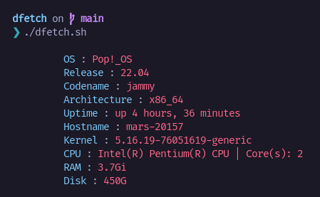

# Dfetch
A **Bash** script to print **system information**.

## Usage
1. Clone this repo.
2. Navigate to the cloned folder.
    - `cd dfetch`
3. Add execute permissions.
    - `chmod +x dfetch.sh`
4. Run the script.
    - `./dfetch.sh`
